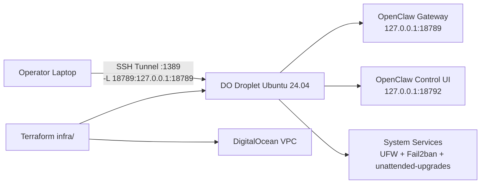

# Architecture

## Security model

- Gateway and dashboard are loopback-bound on server.
- No direct public exposure of OpenClaw ports.
- Access path is SSH-only with local forwarding.
- Host-level controls: firewall, SSH hardening, fail2ban, patching.
